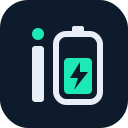
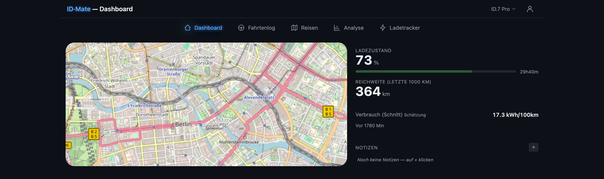
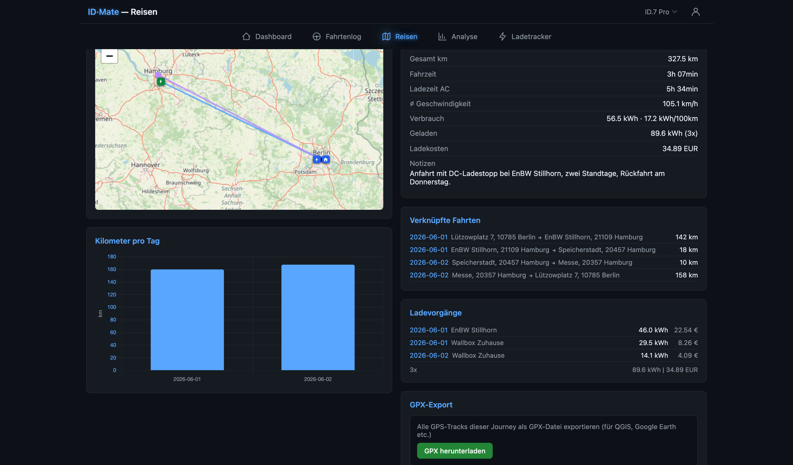
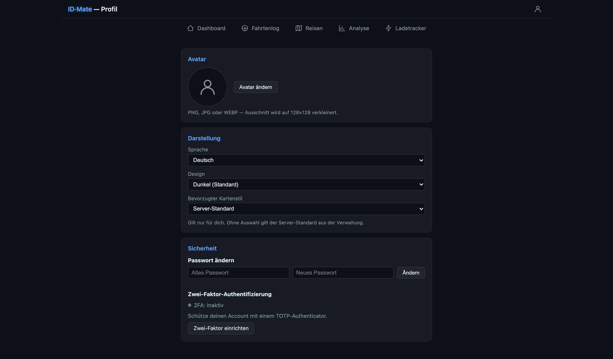
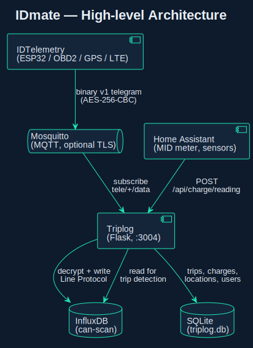
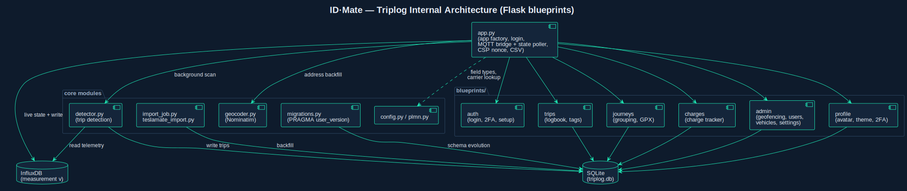
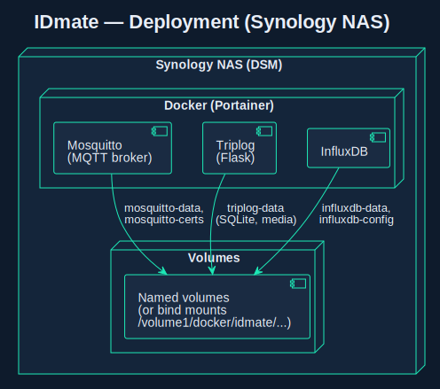
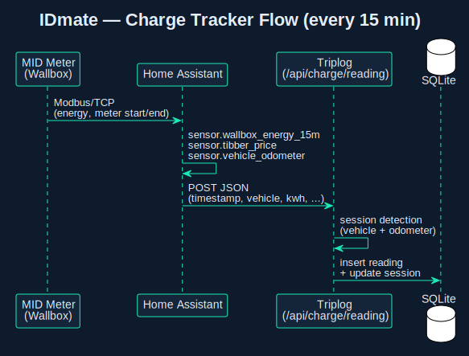

# IDmate



> 🔌 **Companion firmware:** [IDTelemetry](https://github.com/TheInGoF/IDTelemetry) — the ESP32-S3 stick that collects the data and sends it here over MQTT.

**Self-hosted telemetry & trip log for non-Tesla EVs.**
Collects data via **IDTelemetry** (ESP32/OBD2) over **MQTT with AES-256-CBC** encryption and via **Home Assistant** webhooks.
Stores everything in InfluxDB + SQLite and ships with a built-in **trip log** (Triplog) — dashboard, logbook, journeys, charge tracker, geofencing, analysis and user management.

To my knowledge it is the only open-source, self-hosted telemetry + trip log built specifically for **non-Tesla EVs**: it reads the car directly over **OBD2/CAN** (via the [IDTelemetry](https://github.com/TheInGoF/IDTelemetry) stick) instead of relying on a vendor API the VW ID family does not provide.

> **Note:** This is a personal hobby project built for the data-obsessed self-hoster.
> It is not intended for commercial use and comes with no warranties or support guarantees.

---

## Contents

- [Why does this exist?](#why-does-this-exist)
- [Who is this for?](#who-is-this-for)
- [Screenshots](#screenshots)
- [Quick Start](#quick-start)
- [Architecture](#architecture)
- [Setup — Portainer](#setup--portainer)
- [Features](#features)
- [Home Assistant Automation](#home-assistant-automation)
- [Data Source](#data-source)
- [Image Tags & Updates](#image-tags--updates)
- [Backup & Restore](#backup--restore)
- [Project Structure](#project-structure)
- [FAQ](#faq)
- [Development](#development)
- [License](#license)

> **Full setup walkthrough:** [How-To: Setup IDmate + IDTelemetry](docs/HOW-TO-SETUP.md) — MQTT & router port-forwarding, remote access via DuckDNS/Synology, vehicle onboarding and the Home Assistant connection, all in one guide.

---

## Why does this exist?

Massive props to [TeslaMate](https://github.com/teslamate-org/teslamate) — I happily ran it for years and it spoiled me. Then an ID.7 joined the family, and reality hit:

- **VW telemetry is essentially non-existent** — no API, no public data feed, the official app is a black box.
- **And how the hell do I track my charging costs automatically** so I can hand a clean monthly report to my employer?
- And honestly: **while VW is still busy figuring out a halfway-acceptable UI in their cars** 🙃, I'd rather build my own.

So I built **IDmate**: same spirit as TeslaMate (visualise vehicle data, track trips, monitor battery health), but starting from CAN/OBD2 via an ESP32 stick instead of a vendor API — plus a Home Assistant webhook for wallbox energy/cost tracking.

IDmate is **not a fork** of TeslaMate and contains no code from it.

[↑ Contents](#contents)

---

## Who is this for?

- **Non-Tesla EV owners** (VW ID.3 / ID.4 / ID.5 / ID.7 / ID. Buzz and other CAN/OBD2-readable EVs) who want the kind of insight TeslaMate gives Tesla drivers.
- **Self-hosters** who want their telemetry on their own InfluxDB + SQLite — their data, their broker, their dashboard, no cloud.
- **Company-car / business drivers** who need an automatic, exportable trip log and per-charge cost breakdown for monthly expense reports.
- **Home Assistant users** who already meter their wallbox and want charging energy and cost tracked per session and per vehicle.
- **ABRP users** who want live SoC and consumption from a non-Tesla via the stick's BLE ELM327 emulation.

Not the right fit if you drive a Tesla (use TeslaMate), want a plug-and-play cloud service, or don't want to run Docker and flash an ESP32.

[↑ Contents](#contents)

---

## Screenshots

### Vehicle Dashboard



Live map with heading arrow, SoC, range, charge status and geofence pins.

### Trip Logbook


Automatic trip detection from InfluxDB. Per-trip purpose, destination, reason, notes — with batch edit and CSV export.

### Journeys



Group multiple trips into a journey with a combined map, per-leg trip list, the
charges that happened along the way and one-click GPX export.

### Analysis


Charts for trips, purposes, battery health and efficiency (temperature/speed correlation), scoped by a unified Grafana-style date-range picker.

### Charge Tracker


Wallbox sessions (15-min readings via Home Assistant) and external/DC charges. Tibber vs. flat-rate comparison.

### Settings / Admin


Role-aware admin: geofences (radius + custom icons, auto-suggested from frequently visited places), charge stations & operators, vehicles, users with per-user vehicle visibility, value rename/merge, GPX/TeslaMate import and the telemetry/database tools.

### Profile



Per-user profile: avatar editor (crop/zoom), language, theme and map-style preference, password change and TOTP two-factor setup with recovery codes.

[↑ Contents](#contents)

---

## Quick Start

```bash
git clone https://github.com/TheInGoF/IDMate.git
cd IDMate
cp .env.example .env
nano .env          # fill in your values (see table below)
docker-compose up -d
```

Then open:

- **Triplog** — <http://your-host:3004>
- **InfluxDB** — <http://your-host:3001>

> **Important:** Set `INFLUX_TOKEN` *before* the first start. Changing it later requires resetting the InfluxDB volume.

For custom volume paths (e.g. Synology NAS) copy `docker-compose.yml` to `docker-compose.local.yml` and adjust the volumes:

```bash
docker-compose -f docker-compose.local.yml up -d
```

> **Going further?** For MQTT & router port-forwarding, remote access (DuckDNS/Synology), adding a vehicle and the Home Assistant connection, follow the [full setup guide](docs/HOW-TO-SETUP.md).

[↑ Contents](#contents)

---

## Architecture



Source: [docs/diagrams/architecture.puml](docs/diagrams/architecture.puml) — re-render with `plantuml -tsvg docs/diagrams/*.puml`.

### Triplog internals



Triplog itself is a small Flask app split into blueprints (`auth`, `trips`, `journeys`, `charges`, `admin`, `profile`) around a thin `app.py` core that owns the MQTT→InfluxDB bridge, the live-state poller, CSP/CSRF hardening and CSV export. Schema changes run through versioned migrations (`PRAGMA user_version`), trip detection and geocoding run as background threads. Source: [docs/diagrams/triplog-internals.puml](docs/diagrams/triplog-internals.puml).

### Deployment



Source: [docs/diagrams/infrastructure.puml](docs/diagrams/infrastructure.puml)

### Charge Tracker Flow



Source: [docs/diagrams/charge-flow.puml](docs/diagrams/charge-flow.puml)

The **MID meter** (calibrated energy meter at the wallbox) is integrated into Home Assistant via **Modbus/TCP**. Home Assistant calculates 15-minute intervals and posts the readings to the Triplog Charge Tracker via REST webhook.

[↑ Contents](#contents)

---

## Setup — Portainer

1. **Stacks > Add Stack > Web editor**
2. **Name:** `idmate`
3. Paste the contents of [docker-compose.yml](docker-compose.yml) into the editor.
4. *Optional:* For custom volume paths (e.g. Synology NAS), replace named volumes with bind mounts (e.g. `influxdb-data:/var/lib/influxdb2` → `/volume1/docker/idmate/influxdb/data:/var/lib/influxdb2`).
5. **Environment variables > Advanced mode** — paste the block below and adjust the values:

```env
INFLUX_PORT=3001
INFLUX_USER=admin
INFLUX_PASS=change-me
INFLUX_ORG=home
INFLUX_BUCKET=can-scan
INFLUX_TOKEN=change-me-to-a-long-random-token
INFLUX_DEVICE=id7
TRIPLOG_PORT=3004
SECRET_KEY=
LANGUAGE=DE
MQTT_PORT=3005
MQTT_DATA_TOPIC=tele/+/data
MQTT_DOMAIN=localhost
MQTT_TLS=0
# generate with: openssl rand -hex 32  (must match ESP firmware)
MQTT_AES_KEY=
CHARGE_WEBHOOK_TOKEN=
```

> **First start:** Triplog has no users on first launch — open `http://your-host:3004/setup` and the wizard will create the admin account (username, password, optional 2FA). No default credentials are shipped.

### ⚠️ Generating tokens, keys and secrets

Use a cryptographically secure random number generator. **Never** ask a chatbot or LLM to "give me a random 32-byte key" — LLM output is probability-distributed, not random. The same prompt produces a small, predictable distribution of values that an attacker can enumerate offline. The convenience is not worth the silent loss of entropy.

Use these instead:

```bash
openssl rand -hex 32                                  # AES-256 key, SECRET_KEY
openssl rand -base64 32                               # API/webhook tokens
python3 -c "import secrets; print(secrets.token_hex(32))"
```

This applies to `INFLUX_TOKEN`, `SECRET_KEY`, `MQTT_AES_KEY` and `CHARGE_WEBHOOK_TOKEN`.

- For private image repos: add a ghcr.io registry under **Registries** with a GitHub PAT (`read:packages`).
- **Deploy the stack.**

> All images are built via GitHub Actions and pushed to ghcr.io — no local `docker build` needed, no bind mounts required, works with the Portainer web editor.

### Environment Variables

| Variable | Description | Default |
| --- | --- | --- |
| `INFLUX_PORT` | InfluxDB external port | 3001 |
| `INFLUX_USER` | InfluxDB admin user | — |
| `INFLUX_PASS` | InfluxDB admin password | — |
| `INFLUX_ORG` | InfluxDB organisation | home |
| `INFLUX_BUCKET` | InfluxDB bucket | can-scan |
| `INFLUX_TOKEN` | InfluxDB API token | — |
| `INFLUX_DEVICE` | Device tag in InfluxDB | id7 |
| `TRIPLOG_PORT` | Triplog external port | 3004 |
| `SECRET_KEY` | Flask session secret (auto-generated + persisted if empty) | — |
| `LANGUAGE` | UI language (`DE` or `EN`) | DE |
| `ENABLE_DEBUG` | Expose `/debug`, `/scan-debug`, `/influx-delete` routes | 1 |
| `CHARGE_WEBHOOK_TOKEN` | Charge tracker webhook token (optional) | (empty = no auth) |
| `MQTT_PORT` | Mosquitto external port | 3005 |
| `MQTT_DATA_TOPIC` | MQTT topic pattern for telemetry | `tele/+/data` |
| `MQTT_AES_KEY` | Hex-encoded 32-byte AES-256 key (must match ESP) | — |
| `MQTT_TLS` | Enable TLS to broker (`0` or `1`) | 0 |
| `MQTT_DOMAIN` | Hostname used in Mosquitto cert config | localhost |

[↑ Contents](#contents)

---

## Features

### Triplog (Trip Log)

Standalone Python service on port 3004 — **not an official logbook**, but a personal trip log:

- 🔐 **Login/Auth** — session-based authentication, admin role, multi-user, optional TOTP 2FA with recovery codes
- 🙋 **Per-user Profile** — avatar editor, own language/theme/map-style, password & 2FA management
- 🚗 **Vehicle Dashboard** — current status, SoC, range, map with heading arrow and geofence pins
- 🚙 **Multi-vehicle** — switch the active vehicle from the header; admins set per-user vehicle visibility
- 🛣️ **Automatic Trip Detection** from InfluxDB (every 5 min), including delta decompression
- 📒 **Trip Logbook** — purposes, destinations, visit reasons, notes, batch assignment, per-user trip tags
- 🗺️ **Journeys** — group multiple trips, combined map, charges along the route, GPX export
- 📊 **Analysis** — charts for trips, purposes, battery health, efficiency (temperature/speed correlation)
- 📅 **Date-range picker** — unified Grafana-style range selector across trips, charges and analysis
- 📍 **Geofencing** — saved locations with radius, automatic destination matching, custom icons/colors
- ⚙️ **Admin** — rename/merge/delete values, edit locations, manage users, map style, GPX/TeslaMate import
- 🎨 **Theming** — dark/light themes via CSS design tokens; hardened CSP (nonce'd inline scripts)
- 🌍 **Reverse Geocoding** via Nominatim (start/destination addresses)
- 📤 **CSV Export** — filterable by year/purpose
- 🗣️ **i18n** — German and English UI, switchable per user and server-wide

### Charge Tracker (details)

Tracks wallbox charges (15-min intervals via Home Assistant) and external charges (DC fast chargers, etc.):

- **Webhook Receiver** — `POST /api/charge/reading` accepts quarter-hour readings
- **Session Detection** — grouping by vehicle + odometer
- **Tibber vs. Flat Rate** — comparison of dynamic electricity costs with annual flat rate
- **CSV Import** — historical data from Google Sheets (German number format)
- **External Charges** — manual entry of DC/third-party charges with separate session numbers
- **Vehicle Management** — plate, name, VIN

[↑ Contents](#contents)

---

## Home Assistant Automation

For automatic charge data collection every 15 minutes:

**1. REST Command in `configuration.yaml`:**

```yaml
rest_command:
  idmate_charge_reading:
    url: "http://192.168.x.y:3004/api/charge/reading"
    method: POST
    headers:
      Content-Type: application/json
      Authorization: "Bearer {{ states('input_text.idmate_token') }}"
    payload: >-
      {
        "timestamp": "{{ now().strftime('%Y-%m-%d %H:%M') }}",
        "vehicle": "{{ states('input_select.wallbox_vehicle') }}",
        "kwh": {{ states('sensor.wallbox_energy_15m') | float(0) }},
        "meter_start": {{ states('sensor.wallbox_meter_start') | float(0) }},
        "meter_end": {{ states('sensor.wallbox_meter_end') | float(0) }},
        "tibber_price": {{ states('sensor.tibber_price') | float(0) }},
        "tibber_grundgebuehr": {{ states('sensor.tibber_grundgebuehr_15m') | float(0) }},
        "odometer": {{ states('sensor.vehicle_odometer') | float(0) }}
      }
```

**2. Automation (every 15 minutes):**

```yaml
automation:
  - alias: "IDmate send charge data"
    trigger:
      - platform: time_pattern
        minutes: "/15"
    condition:
      - condition: numeric_state
        entity_id: sensor.wallbox_energy_15m
        above: 0
    action:
      - service: rest_command.idmate_charge_reading
```

> Sensor entity IDs must be adapted to your HA installation. The `CHARGE_WEBHOOK_TOKEN` is optional — without a token, no auth is required (suitable for internal networks). For external access, set a token in `.env`: `CHARGE_WEBHOOK_TOKEN=my-secret-token`.

[↑ Contents](#contents)

---

## Data Source

IDTelemetry (ESP32) publishes a **binary telegram** to MQTT topic `tele/<device>/data` roughly every 10 s. The payload is **AES-256-CBC** encrypted (PKCS7 padding) with a per-message random IV:

```text
[1 byte version=0x01|0x02][16 byte IV][AES-256-CBC ciphertext]
```

The leading version byte selects the field layout (`v2` widens the cumulative-energy `kw` field to u32); Triplog decodes whichever version a device sends.

Plaintext layout (after decryption):

- `field_mask` (u32, little-endian) — bit `n` set ⇒ field `n` is present in this telegram
- packed field values in fixed order (lat/lon as int * 1e6, speed/power/voltage as scaled u16/i16, booleans encoded purely via `field_mask`, …)

Triplog subscribes via `paho-mqtt`, decrypts each message with `MQTT_AES_KEY`, decodes the binary fields and writes them into InfluxDB as Line Protocol. Field names are kept short (e.g. `s` = speed, `u` = HV voltage, `p` = power, `la`/`lo` = GPS, `bt` = battery temp). Mapping to readable names happens in the Triplog UI.

> The AES key is shared between the ESP firmware and Triplog (`MQTT_AES_KEY`, hex-encoded 32 bytes). Messages with wrong keys are silently dropped.

[↑ Contents](#contents)

---

## Image Tags & Updates

Container images are published to `ghcr.io/theingof/idmate` with the following tag matrix:

| Tag | When to use | Stability |
| --- | --- | --- |
| `1.2.3` | Pin to an exact release | Most stable |
| `1.2` | Auto-update patches within `1.2.x` | Stable |
| `1` | Auto-update minors within `1.x` | Recommended for most |
| `latest` | Always newest main | Active development — read release notes before pulling |

Multi-arch: `linux/amd64` and `linux/arm64` (Synology DS920+, Raspberry Pi 4/5, Apple Silicon, …).

To update:

```bash
docker compose pull && docker compose up -d
```

[↑ Contents](#contents)

---

## Backup & Restore

State lives in three named volumes: `triplog-data` (SQLite + uploads), `influxdb-data` (time-series), `mosquitto-data` (MQTT persistence). Back them up while the stack runs (SQLite is read-consistent during a single tar pass, InfluxDB writes are append-only):

```bash
mkdir -p backup && cd backup
for v in triplog-data influxdb-data influxdb-config mosquitto-data mosquitto-certs; do
  docker run --rm -v idmate_${v}:/src -v "$PWD":/dst alpine \
    tar czf /dst/${v}-$(date +%F).tar.gz -C /src .
done
```

Restore by stopping the stack, recreating empty volumes and untarring back into them:

```bash
docker compose down
for v in triplog-data influxdb-data influxdb-config mosquitto-data mosquitto-certs; do
  docker volume create idmate_${v}
  docker run --rm -v idmate_${v}:/dst -v "$PWD":/src alpine \
    tar xzf /src/${v}-YYYY-MM-DD.tar.gz -C /dst
done
docker compose up -d
```

> The volume prefix (`idmate_`) is the Compose project name — adapt if your stack runs under a different name (`docker volume ls` to verify).

[↑ Contents](#contents)

---

## Project Structure

```text
IDMate/
├── docker-compose.yml              # Stack (named volumes, ghcr.io images)
├── .env.example                    # Credential template
├── .env                            # Actual credentials (gitignored)
├── docs/
│   ├── diagrams/                   # PlantUML sources + rendered SVGs
│   └── screenshots/                # README screenshots
├── mosquitto/                      # MQTT broker (TLS)
└── triplog/                        # Trip log service (Python/Flask)
    ├── Dockerfile
    ├── requirements.txt            # runtime deps
    ├── requirements-dev.txt        # test/lint deps
    ├── app.py                      # app core: factory, auth, MQTT bridge, state poller, CSV, CSP
    ├── blueprints/                 # route modules split out of app.py
    │   ├── auth.py                 #   login, setup wizard, 2FA
    │   ├── trips.py                #   trip logbook + tags
    │   ├── journeys.py             #   journey grouping + GPX
    │   ├── charges.py              #   charge tracker
    │   ├── admin.py                #   geofencing, users, vehicles, settings
    │   └── profile.py              #   avatar, theme, language, 2FA
    ├── detector.py                 # trip detection + delta decompression
    ├── geocoder.py                 # reverse geocoding (Nominatim)
    ├── import_job.py               # CSV/backfill import worker
    ├── teslamate_import.py         # optional TeslaMate (Postgres) import
    ├── migrations.py               # versioned SQLite migrations (PRAGMA user_version)
    ├── config.py                   # configuration via environment variables
    ├── plmn.py                     # mobile-carrier (PLMN) name/colour lookup
    ├── schema.sql                  # SQLite base schema
    ├── lang/                       # de.json / en.json translation catalogs
    ├── tests/                      # pytest suite (detector + app + migrations)
    ├── static/                     # logo, CSS design tokens, JS, PWA assets
    └── templates/                  # Flask Jinja templates
```

[↑ Contents](#contents)

---

## FAQ

**Is there a TeslaMate alternative for non-Tesla EVs?**
That is what IDmate is. Same idea — self-hosted dashboard, trip log, battery-health and charge tracking — but it reads the car over OBD2/CAN through the IDTelemetry ESP32 stick instead of a vendor API, because the VW ID family has none.

**Can I track my EV charging costs automatically for an employer expense report?**
Yes. The charge tracker logs every session (wallbox via Home Assistant plus external/DC charges), breaks down energy and cost per session and per vehicle, supports a dynamic (Tibber) vs. flat-rate comparison, and the trip log exports to CSV.

**Does it work with a VW ID.3 / ID.4 / ID.5 / ID.7 / ID. Buzz?**
Yes — anything the IDTelemetry stick can read over CAN/OBD2. The stick targets the MEB platform; other EVs work if their OBD2/UDS PIDs are readable.

**Do I need the IDTelemetry hardware?**
For live driving telemetry (SoC, position, power, battery temperature) yes — that is the data source. Charge data alone can come from Home Assistant webhooks without the stick, and SoC/odometer can be fed the same way.

**Is my data sent to any cloud?**
No. Everything runs on your own host: Mosquitto, Triplog, InfluxDB and SQLite. MQTT payloads are AES-256-CBC encrypted, there are no default credentials, and no telemetry leaves your network.

**How do I get live vehicle data into ABRP (A Better Routeplanner)?**
The IDTelemetry stick emulates a BLE ELM327, so ABRP pairs with it like a standard OBD2 dongle.

**Why two databases?**
InfluxDB for time-series telemetry (efficient range queries) and SQLite for relational data (trips, vehicles, users, charge sessions).

[↑ Contents](#contents)

---

## Development

Triplog is a single Flask app, split into blueprints around a thin `app.py` core
(see [Triplog internals](#triplog-internals)). Schema changes are versioned
migrations keyed off `PRAGMA user_version` — never hand-edit a live DB. Trip
detection and reverse geocoding run as background threads; the dashboard live
state is fed by a separate InfluxDB poller.

Run the test suite (detector logic, app routes, migrations) from `triplog/`:

```bash
python -m venv .venv && . .venv/bin/activate
pip install -r requirements.txt -r requirements-dev.txt
SECRET_KEY=test python -m pytest tests/ -q
```

CI (GitHub Actions) runs the same suite plus a boot smoke-test as a gate before
the container images are built and pushed to ghcr.io.

This project was developed in a human-in-the-loop workflow with AI assistance.
Architecture, code and configuration were created in dialogue — all decisions were made by the human.

[↑ Contents](#contents)

---

## License

GNU Affero General Public License v3.0 — see [LICENSE](LICENSE)

[↑ Contents](#contents)

---

[](https://ko-fi.com/lordvonbaum)

> Donations are voluntary and solely support the project. They do not influence the prioritisation of bugs, feature requests or support enquiries.
